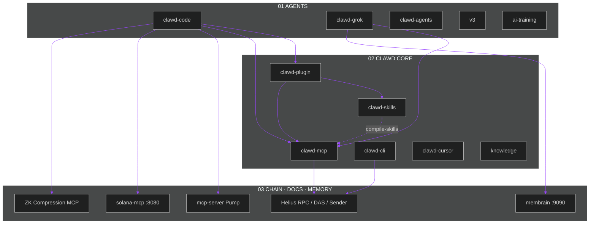
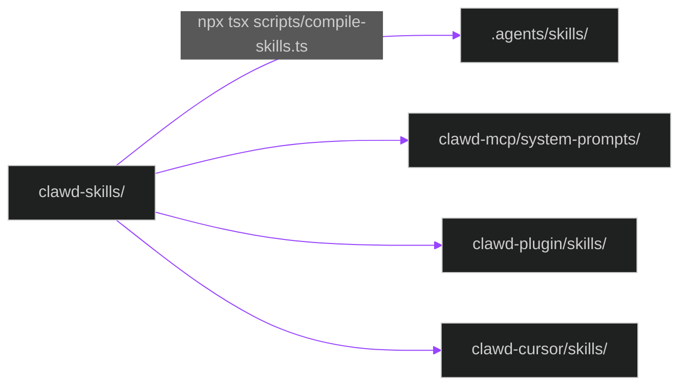

<div align="center">


<p>
  <a href="https://phantom.com/tokens/solana/8cHzQHUS2s2h8TzCmfqPKYiM4dSt4roa3n7MyRLApump"></a>
  <a href="https://dexscreener.com/solana/8cHzQHUS2s2h8TzCmfqPKYiM4dSt4roa3n7MyRLApump"></a>
  <a href="https://jup.ag/swap/SOL-8cHzQHUS2s2h8TzCmfqPKYiM4dSt4roa3n7MyRLApump"></a>
  <a href="https://huggingface.co/ordlibrary/DeepSolanaZKr-1"></a>
  <a href="LICENSE"></a>
</p>

```text
Token   $CLAWD · 8cHzQHUS2s2h8TzCmfqPKYiM4dSt4roa3n7MyRLApump
Model   ordlibrary/DeepSolanaZKr-1 · solanaclawd/solana-clawd-1.5b-lora
```

</div>

# Clawd Core AI

Lobster-native Solana agent stack. **Clawd Core is the identity. Helius is the pipe.**

Clawd Code talks. Clawd MCP queries the chain. Clawd CLI signs you up. Membrain remembers. Grok 4.6 thinks. `$CLAWD` on the beach.

## Live map

Agents on top. Core in the middle. Chain, docs, and memory at the edge. Packets never stop.

<div align="center">
  
</div>



Chain I/O still rides Helius RPC, DAS, Sender, Laserstream, and the Wallet API (`helius-sdk`, `HELIUS_API_KEY`). Everything an agent installs, invokes, or configures is named Clawd.

## Packages

| Package | What it is | How to run |
|---|---|---|
| [`clawd-cli`](./clawd-cli) | CLI for Helius account setup, DAS/RPC queries, staking, ZK compression | `npm install -g clawd-cli` then `clawd-cli config set-api-key <key>` |
| [`clawd-mcp`](./clawd-mcp) | MCP server — 9 routed domain tools plus `expandResult` | `npx clawd-mcp@latest` in `.clawd/settings.json` |
| [`clawd-skills`](./clawd-skills) | Canonical skill source (`SKILL.md` + references) | `./clawd-skills/clawd/install.sh` |
| [`clawd-plugin`](./clawd-plugin) | Clawd Code plugin — skills + auto-start MCP | `clawd --plugin-dir ./clawd-plugin` |
| [`clawd-cursor`](./clawd-cursor) | Cursor skills, rules, and MCP config | Cursor marketplace / local plugin dir |
| [`clawd-code`](./clawd-code) | Solana-native AI CLI — xAI / Anthropic / DeepSeek / OpenRouter, paper-gated perps | `cd clawd-code && npm install && npm run build` |
| [`clawd-grok`](./clawd-grok) | Bun-native Grok runtime — default `grok-4.6` Responses API, REPL, audio, LSP, MCP, wallet | `cd clawd-grok && bun install && bun run dev` |
| [`membrain`](./membrain) | Selective memory daemon — gRPC `:9090`, SQLite / pgvector | `cd membrain && make build && ./bin/membraned` |
| [`clawd-agents`](./clawd-agents) | Perps agents: Phoenix Rise, Vulcan, Imperial, TWAMM, on-chain MM, Telegram | `cd clawd-agents/clawd-perps-agent && npm install && npm run build` |
| [`mcp-server`](./mcp-server) | Pump SDK MCP — quotes, AMM, fees, metadata (builds txs, does not submit) | `npm run mcp:pump:start` |
| [`solana-mcp`](./solana-mcp) | Official Solana docs MCP — RAG search + canonical retrieval | `npm run mcp:solana:dev` → `http://localhost:8080/mcp` |
| [`v3`](./v3) | Next-gen Clawd runtime scaffold | `cd v3 && npm install && npm run build` |
| [`knowledge`](./knowledge) | Facts, gotchas, patterns, decisions | read-only |
| [`ai-training`](./ai-training) | LoRA / HF Jobs / W&B / Solana benchmark | see `AGENTS.md` |
| [`docs`](./docs) | Architecture decision records + SVG maps | read-only |

## Quick start

Install per package. There is no repo-wide `npm install`.

```bash
git clone <repo-url>
cd core-ai

cd clawd-mcp && pnpm install && pnpm build
cd ../clawd-cli && pnpm install && pnpm build
cd ../mcp-server && npm install && npm run build
cd ../solana-mcp && pnpm install && pnpm build
```

Agent loop:

```bash
clawd --plugin-dir ./clawd-plugin
```

Or MCP-only in `.clawd/settings.json`:

```json
{
  "mcpServers": {
    "clawd": {
      "command": "npx",
      "args": ["clawd-mcp@latest"]
    }
  }
}
```

Set `HELIUS_API_KEY` (or run `clawd-cli config set-api-key` / `clawd-cli signup`). Keys live in `~/.clawd/config.json` because that is still the Helius account store.

## MCP servers

| Server | Path / package | Transport | Command / URL |
|---|---|---|---|
| Clawd MCP | [`clawd-mcp`](./clawd-mcp) / `clawd-mcp@latest` | stdio | `npx clawd-mcp@latest` |
| Pump MCP | [`mcp-server`](./mcp-server) | stdio or HTTP | `npm run mcp:pump:start` / `npm run mcp:pump:start:http` |
| Solana Docs MCP | [`solana-mcp`](./solana-mcp) | HTTP `:8080` | `npm run mcp:solana:dev` |
| ZK Compression | external | HTTP | `https://www.zkcompression.com/mcp` |
| DFlow | external | HTTP | `https://pond.dflow.net/mcp` |

Root helpers:

```bash
npm run mcp:pump:build
npm run mcp:pump:start
npm run mcp:pump:start:http
npm run mcp:solana:build
npm run mcp:solana:dev
npm run mcp:solana:start
npm run membrain:build
npm run membrain:test
npm run membrain:start
npm run compile-skills
```

Pump MCP (after `cd mcp-server && npm install && npm run build`):

```json
{
  "mcpServers": {
    "solana-clawd-pump": {
      "command": "node",
      "args": ["./mcp-server/dist/index.js"],
      "env": {
        "SOLANA_RPC_URL": "https://api.mainnet-beta.solana.com"
      }
    }
  }
}
```

Solana docs MCP:

```json
{
  "mcpServers": {
    "solana-docs": {
      "type": "http",
      "url": "http://localhost:8080/mcp"
    }
  }
}
```

`solana-mcp` defaults to port `8080`. Copy `solana-mcp/.env.example` to `solana-mcp/.env` and set Databricks credentials for live RAG. `list_sections` works without secrets.

ZK Compression:

```bash
npx skills add Lightprotocol/skills
```

```json
{
  "mcpServers": {
    "zkcompression": {
      "type": "http",
      "url": "https://www.zkcompression.com/mcp"
    }
  }
}
```

## Clawd MCP tools

Ten public tools. Nine routed domains plus `expandResult`. Pass a Helius action name in `action`.

```mermaid
%%{init: {"theme":"dark","themeVariables":{"primaryColor":"#10182a","primaryTextColor":"#14F195","lineColor":"#14F195"}}}%%
flowchart LR
  A[clawdAccount] --- W[clawdWallet]
  W --- S[clawdAsset]
  S --- T[clawdTransaction]
  T --- C[clawdChain]
  C --- R[clawdStreaming]
  R --- K[clawdKnowledge]
  K --- WR[clawdWrite]
  WR --- Z[clawdCompression]
  Z --- X[expandResult]
```



| Tool | Use for |
|---|---|
| `clawdAccount` | Signup, API keys, plans, billing |
| `clawdWallet` | Balances, holdings, identity, wallet history |
| `clawdAsset` | DAS assets, NFTs, collections, proofs |
| `clawdTransaction` | Parsed txs and wallet activity |
| `clawdChain` | Raw accounts, blocks, stake, priority fees |
| `clawdStreaming` | Webhooks and live subscriptions |
| `clawdKnowledge` | Docs, guides, rate limits, troubleshooting |
| `clawdWrite` | SOL/token transfers and staking |
| `clawdCompression` | ZK compression state and proofs |
| `expandResult` | Expand summary-first payloads |

Example: `clawdWallet` + `getBalance`, `clawdStreaming` + `createWebhook`.

## clawd-cli

```bash
npm install -g clawd-cli
clawd-cli config set-api-key <your-api-key>
clawd-cli balance <wallet-address>
clawd-cli tx parse <signature>
```

Binary is `clawd-cli`. OAuth against the Helius dashboard still uses client id `helius-cli`. Config stays in `~/.clawd/`.

## Skills

Canonical source is [`clawd-skills/`](./clawd-skills). Compiler output lands in `.agents/skills/` and `clawd-mcp/system-prompts/`.



| Skill | Directory | Invoke |
|---|---|---|
| Clawd Core | [`clawd-skills/clawd`](./clawd-skills/clawd) | `/clawd:build` |
| Clawd DFlow | [`clawd-skills/clawd-dflow`](./clawd-skills/clawd-dflow) | `/clawd:dflow` |
| Clawd Jupiter | [`clawd-skills/clawd-jupiter`](./clawd-skills/clawd-jupiter) | `/clawd:jupiter` |
| Clawd Phantom | [`clawd-skills/clawd-phantom`](./clawd-skills/clawd-phantom) | `/clawd:phantom` |
| Clawd OKX | [`clawd-skills/clawd-okx`](./clawd-skills/clawd-okx) | `/clawd:okx` |
| SVM | [`clawd-skills/svm`](./clawd-skills/svm) | `/clawd:svm` |

Edit canonical files, then:

```bash
npx tsx scripts/compile-skills.ts
```

Installers default to `~/.clawd/skills/`. Pass `--project` for `.clawd/skills/`.

## clawd-plugin

```bash
clawd --plugin-dir ./clawd-plugin
```

Bundles the skills above and auto-starts Clawd MCP, DFlow MCP, and ZK Compression MCP.

## Environment variables

Never commit keys.

| Variable | Used by | Purpose |
|---|---|---|
| `HELIUS_API_KEY` | `clawd-cli`, `clawd-mcp`, skills | Helius cloud API |
| `HELIUS_NETWORK` | `clawd-cli`, `clawd-mcp` | `mainnet` / `devnet` |
| `SOLANA_RPC_URL` | `mcp-server`, Clawd Code | Single RPC endpoint |
| `SOLANA_RPC_URLS` | `mcp-server` | Comma-separated failover |
| `XAI_API_KEY` | `clawd-code`, `clawd-grok` | xAI / Grok |
| `GROK_MODEL` | `clawd-grok` | Override (default `grok-4.6`) |
| `GROK_REASONING_EFFORT` | `clawd-grok` | `low` / `medium` / `high` / `xhigh` |
| `GROK_SERVICE_TIER` | `clawd-grok` | Set `priority` for lower-latency xAI |
| `ANTHROPIC_API_KEY` | `clawd-code` | Anthropic |
| `DEEPSEEK_API_KEY` | `clawd-code` | DeepSeek |
| `OPENROUTER_API_KEY` | `clawd-code` | OpenRouter |
| `WANDB_API_KEY` | `ai-training` | W&B |
| `HONCHO_API_KEY` | `ai-training` only | Training-job memory — not Core AI runtime |
| `MEMBRANE_API_KEY` | `membrain` | Optional gRPC auth |
| `MEMBRANE_ENCRYPTION_KEY` | `membrain` | Optional SQLCipher |
| `MEMBRAIN_GRPC_ENDPOINT` | agents | Default `localhost:9090` |
| `DATABRICKS_HOST` | `solana-mcp` | Docs workspace |
| `DATABRICKS_TOKEN` | `solana-mcp` | Local Databricks auth |
| `DATABRICKS_VS_INDEX` | `solana-mcp` | Vector Search index |
| `DATABRICKS_WAREHOUSE_ID` | `solana-mcp` | SQL warehouse |
| `DATABRICKS_ANALYTICS_SCHEMA` | `solana-mcp` | Analytics schema |
| `REDIS_URL` | `solana-mcp` | Optional SSE/session backing |

Clawd Code also reads `~/.clawd-code/.env`.

## Generated content

`npx tsx scripts/compile-skills.ts` reads `clawd-skills/` and writes:

- `.agents/skills/` — Clawd-native skills + prompt variants
- `clawd-mcp/system-prompts/` — npm-shipped prompt copies

Do not edit those outputs. Change canonical source and recompile. Versions live in [`versions.json`](./versions.json).

Animated maps live in [`docs/assets/`](./docs/assets/):

- [`clawd-core-header.svg`](./docs/assets/clawd-core-header.svg)
- [`clawd-core-map.svg`](./docs/assets/clawd-core-map.svg)

## Development

```bash
cd clawd-cli   # or clawd-mcp
pnpm install
pnpm build
pnpm test
```

```bash
cd mcp-server && npm install && npm run build && npm test
cd ../solana-mcp && pnpm install && pnpm build && pnpm test && pnpm audit:security
cd ../membrain && make build && make test
# ./bin/membraned          # gRPC on :9090
# npm run membrain:start   # from repo root
```

| Package | Runtime | Package manager | Notes |
|---|---|---|---|
| `clawd-cli`, `clawd-mcp` | Node.js 20+ | pnpm | `HELIUS_API_KEY` from https://dashboard.helius.dev |
| `mcp-server` | Node.js 18+ | npm | `SOLANA_RPC_URL` / `SOLANA_RPC_URLS`; tools build instructions, they do not submit |
| `solana-mcp` | Node.js 24.x | pnpm 10.30.0 | Databricks for live retrieval; `REDIS_URL` for SSE |
| `clawd-grok` | Bun | bun | Default model `grok-4.6` |
| `membrain` | Go 1.24+ | Make | gRPC `:9090`; optional Postgres via `membrain/docker-compose.yml` |

Agent harness: [`AGENTS.md`](./AGENTS.md). Compatibility shim: [`CLAUDE.md`](./CLAUDE.md) / [`CLAWD.md`](./CLAWD.md). Contributing: [`CONTRIBUTING.md`](./CONTRIBUTING.md).

## Documentation maintenance

Update this README in the same change whenever you add or change a package, MCP server, CLI mode, root script, port, transport, MCP client config, env var, generated path, or verification workflow. If the package map changes, update [`docs/assets/clawd-core-map.svg`](./docs/assets/clawd-core-map.svg) in the same change.

## Resources

- [Clawd Code](./clawd-code)
- [Helius](https://www.helius.dev/) — RPC / DAS / Sender / Laserstream
- [Helius Docs](https://www.helius.dev/docs)
- [helius-sdk](https://www.npmjs.com/package/helius-sdk)
- [Model Context Protocol](https://modelcontextprotocol.io)
